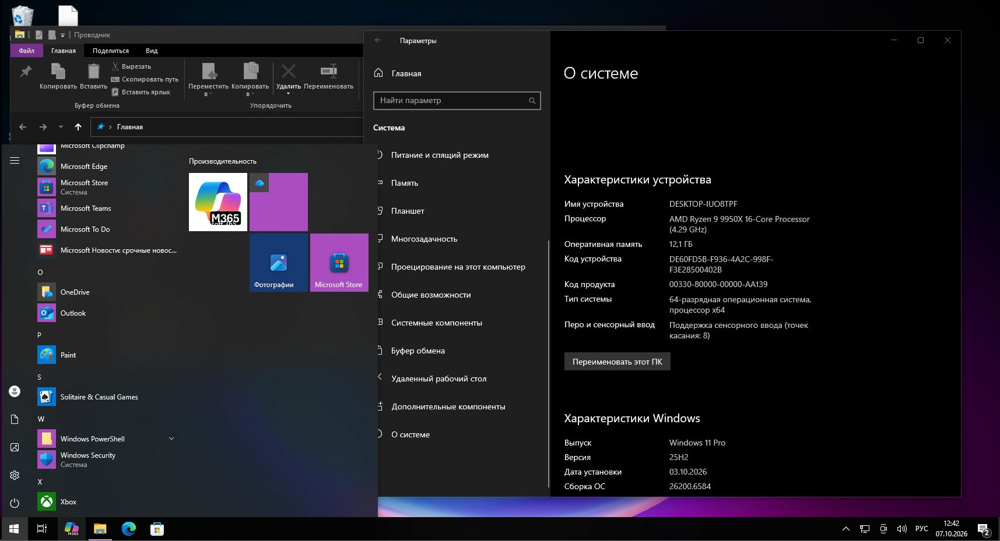

# Windows 10 shell on Windows 11 — b013



Source repository and local media builder. Git does not include Microsoft system
EXE/DLL files, Windows images, PRI/MUI assets, themes, icons, fonts or PDB payloads.
The builder obtains Windows files from the installation image supplied by the user.

## Build

1. Mount your Windows 10 installation ISO.
2. Double-click **Build.bat** and enter its drive or directory, for example `D:\`.
3. Wait for extraction, resource generation, compilation and hidden preflight.
4. Run **Start-Windows10.bat** in `%USERPROFILE%\W10-b013`.
   Use **Stop-Windows10.bat** to restore Windows 11 and **Check-Windows10.bat** to
   check dependencies. Run normally; individual recovery guards request UAC.

```powershell
.\Build.ps1 -MediaPath 'D:\'
.\Build.ps1 -MediaPath 'D:\' -OutputPath 'C:\Users\YourName\W10-b013'
```

Building does not switch the live shell. Stop an earlier copy using its own stop
script before launching another copy. Close existing Settings before enabling the
old Settings session; unrelated processes are not terminated by the launcher.

Optional parameters: `-PythonPath`, `-ZigPath`, `-SevenZipPath`, `-Index`.
Defaults download private portable tools to `.tools`, not a global installation.
Requirements: x64 Python 3.12, Zig 0.15.2 and 7-Zip with WIM/ESD support. Internet is
needed initially for tools, Python wheels and matched official Microsoft symbols.
Keep the generated workspace and `.tools` at their build paths. Rebuild after moving
or renaming them. Allow at least 3 GB of free space.

## Image language

The builder reads the image's LANGUAGES/DEFAULT metadata and extracts its localized
MUI/PRI resources. It does not translate Windows text or inject a different language.
For example, a Russian image selects `ru-RU`; an English image selects `en-US`.
The selected language and image provenance are recorded in `locale.json` and
`outputs/Windows10-Components/Image/media-provenance.json`.

The currently validated code baseline is **Windows 10 Pro x64 19045.5487**. The image
index is discovered from metadata. Other image languages require the same compatible
neutral executable/ABI files. Russian media has been built and tested here; English
language selection is covered by metadata/path tests, not a full English ISO test.
Resource hashes are computed from the user's image; neutral executable hashes stay
pinned. No translated resources are distributed in Git.

## Host compatibility and signatures

b013 supports its reviewed Windows 11 file/ABI profile with Windows installed under
`C:\Windows`. Unknown profiles are rejected before extraction or shell changes.
Masked signatures with `??`/`?` locate executable code sites; a unique match is
required. PCS additionally checks the target of CALL rel32, and the Settings loader
checks the DLL name referenced by LEA. PCS discovers three sites at runtime and
Settings discovers its loader site during the build. See `signature-report.json`.
Other private interfaces and some offsets remain tied to the reviewed ABI profile.
Checksums still verify extraction, authored modules and compatibility not yet covered
by semantic matching. This is not a universal compatibility layer for every update.

## Components and limits

Includes the b013 Explorer 10, old Start and Settings adapters, Task View/Alt+Tab,
private icon resources, the Explorer theme/color fixes, square outer corners and
hover Snap suppression. Sessions run until stopped or signed out, with no one-hour
limit. System files are not replaced. User preferences and private permissions are
journaled; cleanup checks exact process and registration ownership.

The network panel content, Start typing/search and some XAML surfaces remain modern.
Not every Settings page or third-party application style is verified. Successful
assembly and hidden Explorer preflight do not prove every component's visual behavior.

Start source files receive RX access for the Start AppContainer, with an ACL receipt
saved before each change. No Windows directory ACL is modified. The grant script
supports `-Restore` after related processes are stopped; foreign ACL changes are kept.

## Source layout and logs

`templates` contains path-parameterized authored sources, not scripts to run directly.
`packaging` contains inventories, compiler recipes and local guard-generation recipes.
`tools` contains the builder; `tests` contains its regression tests. Historical b013
proofs are explicitly marked and are not presented as tests of freshly built modules.

Generated logs: `build-report.json`, `signature-report.json`, `build-logs` and
`outputs/Windows10-Components/state-*`. READY.json is created only after dependency
checks and the hidden own Explorer folder/theme/icon preflight pass.

## Licenses and Windows files

Use installation media you have the right to use. This repository does not grant a
Windows license or guarantee compliance with every licensing condition. Do not publish
extracted/modified Windows files or the generated runtime folder as part of the source
repository. Binary formats and downloaded caches are excluded by `.gitignore`.

Tools come separately from [Python.org](https://www.python.org/downloads/release/python-31210/),
[Zig](https://ziglang.org/download/), [7-Zip](https://github.com/ip7z/7zip/releases) and
[PyPI](https://pypi.org/). Dependencies retain their own licenses in downloaded packages.
PDB files come from `msdl.microsoft.com`; only URLs and fingerprints are in Git.
The project source license does not apply to Microsoft files or third-party tools.
